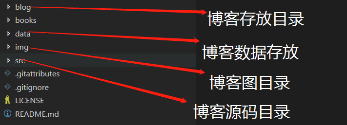
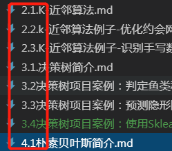
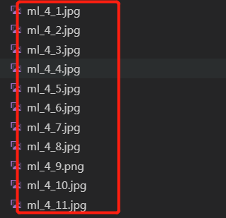

# 1、AILearners上传github文件规范

**文件目录介绍（住：如果对自己的目录名字有想法可以自行修改）**

## 一、**blog目录：存放写的笔记**  

fm目录：blog\ml\jqxxsz

zzm目录：blog\ml\ml_wnd

zpj目录：blog\dl\cs231n

dw目录：blog\Algorithm

gkj/changan目录：blog\nlp\cs224n

## 二、data目录:存放自己笔记的数据

fm目录：data\ml\jqxxsz

zzm目录：data\ml\ml_wnd

zpj目录：data\dl\cs231n

dw目录：data\Algorithm

gkj/changan目录：data\nlp\cs224n

## 三、img目录 ：存放自己笔记的图

fm目录：img\ml\jqxxsz

zzm目录：img\ml\ml_wnd

zpj目录：img\dl\cs231n

dw目录：img\Algorithm

gkj/changan目录：img\nlp\cs224n

## 四、src目录：存放笔记上的源码（分为py2/py3）

**这个目录根据自己笔记源码的python版本或者使用其他编程语言编写的话重新创建对应的文件夹**

eg：fm目录：src\py2.x\ml\jqxxsz

# 2、命名规范

**blog：文章尽量按照12345开头，这样比较有主次 别人看的话一目了然 代码和文章同步就行**

**图片：按照不同章节不同内容进行这样命名**

# 3、文章引流

**文章开头尽量添加这样的引用~**

> 搜索微信公众号:‘AI-ming3526’或者’计算机视觉这件小事’ 获取更多XXX干货  
> csdn：https://blog.csdn.net/baidu_31657889/  
> github：https://github.com/aimi-cn/AILearners  

**文章中可以添加这样的标语~**

本文出现的所有代码，均可在github上下载，不妨来个Star把谢谢~：
[Github代码地址](https://github.com/aimi-cn/AILearners/这篇文章具体代码)

AIMI-CN AI学习交流群【1015286623】

扫码加群：

分享技术，乐享生活：XX公众号每周五推送“=====”系列资讯类文章，欢迎您的关注！

