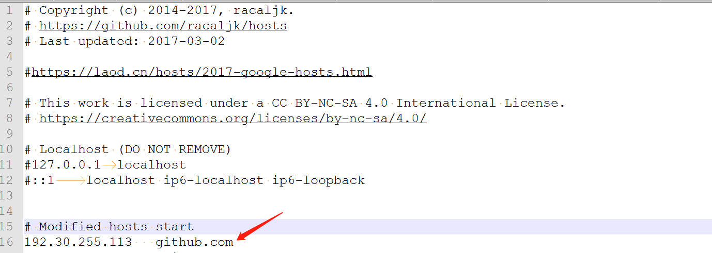
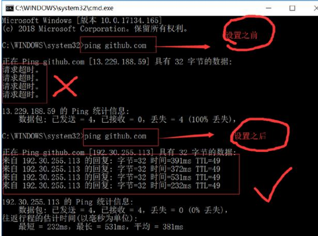

# 解决github国内访问慢的问题

搜索微信公众号:'AI-ming3526'或者'计算机视觉这件小事' 获取更多人工智能干货
csdn：https://blog.csdn.net/baidu_31657889/
github：https://github.com/aimi-cn/

**Github访问速度很慢的原因,遇到GitHub上图片无法加载或者加载速度较慢的解决办法 终极解决方案见第二种方法**

## 一、第一种方法

1. 由于GitHub是一个国外网站，在国内访问速度如何呢？

   我们通过浏览器访问下**https://github.com**，但是页面很久才能打开，要等待一个较长时间

2. 接着我们打开系统工具下的命令提示符，输入 **ping github.com**，但可惜的是出现了“请求超时”的信息提示

3. 优化思路：通过绕过DNS解析，直接在本地绑定host，接下来跟大家详细介绍：

   - [ ] 在浏览器中打开DNS查询网站**http://tool.chinaz.com/dns**，我们输入**github.com**，点击检测，如下图所示：

     

   - [ ] 找到TTL值最小的IP地址，我建议选择的是美国[海外]的ip地址，接着我们打开系统工具下的命令提示符，输入 **ping 192.30.255.113**，(其他TTL值更小的国内ip可能会出现ping超时的情况)。

     

     

   - [ ] 接着我们打开本地电脑的C:\Windows\System32\drivers\etc目录，找到hosts文件。我们使用文本编辑器打开hosts文件，并在文件的末尾一行添加如下信息(**win10的用户把hosts文件复制到桌面修改，修改之后在复制到etc目录下**)，如下图所示：

     **192.30.255.113 github.com**

     

   - [ ] 接着我们再在命令提示符中输入**ping github.com**，此时可以ping通github域名，如下图所示

     

   - [ ] 打开浏览器，输入github.com，可以很快的打开github官网地址


## 二、第二种方法（强烈推荐！！！！！）

**补充：Github访问速度很慢的原因,遇到GitHub上图片无法加载或者加载速度较慢的解决办法 终极解决方案**

绕过dns解析，在本地直接绑定host，该方法也可加速其他因为CDN被屏蔽导致访问慢的网站。

hosts文件所在目录，C:\Windows\System32\drivers\etc

修改windows里的hosts文件，添加如下内容

```python
# GitHub Start 
192.30.253.112 github.com 
192.30.253.119 gist.github.com 
151.101.100.133 assets-cdn.github.com 
151.101.100.133 raw.githubusercontent.com 
151.101.100.133 gist.githubusercontent.com 
151.101.100.133 cloud.githubusercontent.com 
151.101.100.133 camo.githubusercontent.com 
151.101.100.133 avatars0.githubusercontent.com 
151.101.100.133 avatars1.githubusercontent.com 
151.101.100.133 avatars2.githubusercontent.com 
151.101.100.133 avatars3.githubusercontent.com 
151.101.100.133 avatars4.githubusercontent.com 
151.101.100.133 avatars5.githubusercontent.com 
151.101.100.133 avatars6.githubusercontent.com 
151.101.100.133 avatars7.githubusercontent.com 
151.101.100.133 avatars8.githubusercontent.com 
# GitHub End
```

保存后重新刷新DNS：

打开cmd

输入**ipconfig /flushdns**

亲测有用，下载速度明显提升

重新打开Github网站，一切正常。

## 三、第三种方法

fan qiang 需要一个国 外的 服务器搭建一个 tizi

具体的自行解决 
